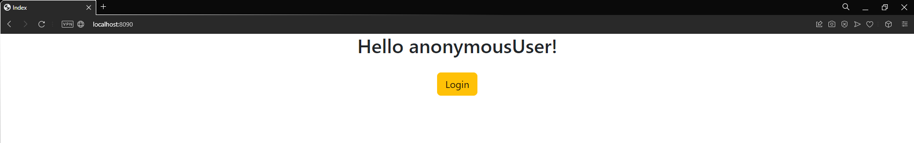
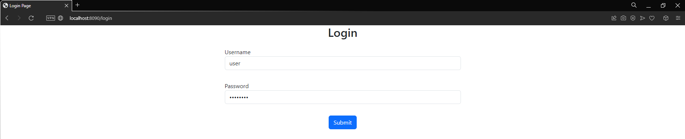
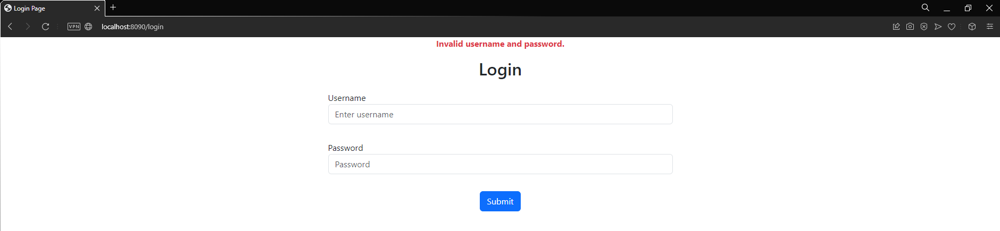
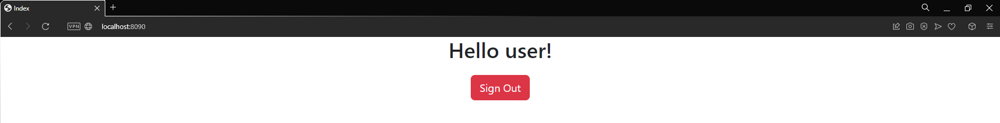
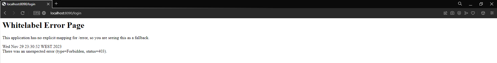
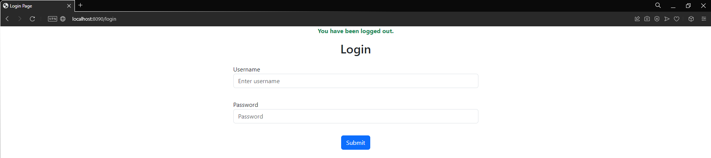

<h3 align="center">Practical Exercise</h3>

## About The Project
Spring Boot Security project

## Tools and technologies used
• Java 17 • Maven • Spring Boot 3 • Spring Web • Spring Security 6 • Thymeleaf •

## Preview
- On our home page, Login button is displayed only when the user is not authenticated. This button redirects the user to the login page

  

- We have a custom login page with two inputs for username and password. While we can use `Customizer.withDefaults()` to get the default login page provided by Spring Boot Security, we opted to create our own.

  
  
- The credentials are loaded in memory.
- If the user enters incorrect credentials, a flash alert will be displayed.

  

- Upon entering the correct credentials, the user is redirected to the home page, now displaying a Sign Out button.

  

- If an authenticated user attempts to access the login page, an error will be thrown.

  

- Clicking the Sign Out button redirects the user to the login page with a flash alert confirming a successful logout.

  
